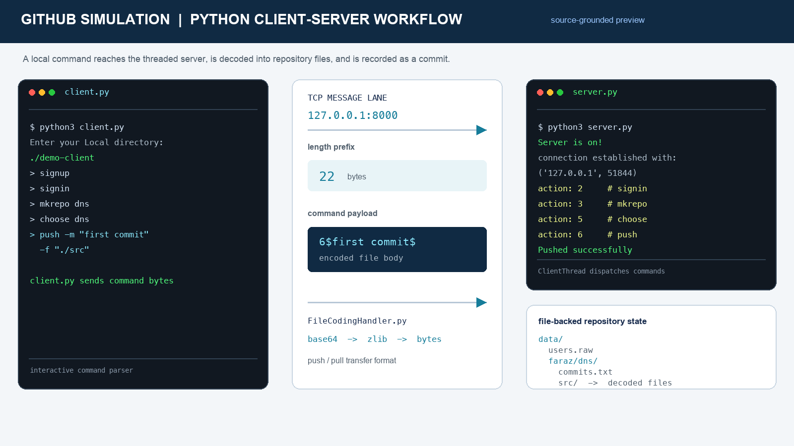

# Git Server Simulation - Python Client/Server Repository Engine



A Python simulation of a Git-style repository service built around a TCP client/server architecture. The client accepts repository commands, serializes them into a small application protocol, and sends them to a threaded server that authenticates users, dispatches actions, encodes file trees, persists repository state, and returns responses.

## Recommended project identity

**Recommended repository name:** `python-git-server-simulation`

**GitHub About description:**

> A Python TCP client-server simulation of Git-style workflows with push/pull, authentication, file encoding, contributors, and file-backed repository persistence.

## What the project demonstrates

- A TCP client and server communicating over `127.0.0.1:8000`.
- A threaded `ClientThread` for per-connection request handling.
- A command parser that maps user-facing commands to numeric protocol actions.
- Length-prefixed message transfer for variable-sized file payloads.
- User registration and sign-in backed by local persistence.
- Repository creation, listing, selection, push, pull, and commit-history viewing.
- Contributor management and cross-user repository inspection.
- Recursive directory encoding with Base64 and zlib compression.
- File-backed repository state under `data/<owner>/<repository>/`.

## Architecture


The client handles interactive input and local file encoding. The server owns authentication, repository selection, command authorization, decoding, and persistence. A session keeps the authenticated username/password and the currently selected repository.

## Request lifecycle

1. The client starts in a local working directory and reads a command such as `signin`, `choose`, `push`, or `pull`.
2. `client_command_handler.parseInput()` converts the command into a `$`-delimited action message.
3. `client.py` sends the encoded message length followed by the message body over TCP.
4. `server.py` reads the length, collects the payload, and passes it to `parseReceivedMessage()`.
5. The dispatcher validates the session state and calls the appropriate file-system operation.
6. File uploads are decoded into the repository directory and commit messages are appended to `commits.txt`.
7. The server sends a length-prefixed response back to the client.

## Protocol actions

| Action | User command | Responsibility |
| ---: | --- | --- |
| 1 | `signup` | Create a user and local data directory |
| 2 | `signin` | Authenticate a user |
| 3 | `mkrepo <name>` | Create a repository |
| 4 | `list` | List repositories visible to the user |
| 5 | `choose <name>` | Select the active repository |
| 6 | `push -m "message" -f "./path"` | Encode and upload a file or directory |
| 7 | `pull -f "./path"` | Download repository content |
| 8 | `view` | Read the repository commit log |
| 9 | `sync` | Request a repository synchronization operation |
| 10 | `userslist` | List registered users |
| 11 | `cont <username>` | Add a contributor to the selected repository |
| 12 | `repolsof <username>` | List another user's repositories |
| 13 | `Opull <user> <repo> -f "./path"` | Pull from another user's repository |

The parser is intentionally lightweight and uses positional tokens. Use straight ASCII quotes around push commit messages and paths, for example:

```text
push -m "initial snapshot" -f "./src"
pull -f "./downloaded-repository"
```

## File transfer format

`FileCodingHandler.py` provides the project's custom transfer format:

- A single file is represented by its type, path, and encoded body.
- A directory is traversed recursively and each file path/body pair is appended to the message.
- File bytes are Base64-encoded and then compressed with zlib.
- The compressed bytes are represented as a space-separated integer string.
- The decoder reconstructs the bytes and writes the original files into the destination path.

This is an educational serialization layer that makes the push/pull process visible. It is not a replacement for Git's object database, hashing, packfiles, or delta compression.

## Repository layout

```text
.
├── client.py                  # TCP client and response handling
├── client_command_handler.py  # CLI command parsing and action encoding
├── server.py                  # Listener, client threads, and dispatch
├── file_system.py             # Users, repositories, auth, and persistence
├── FileCodingHandler.py       # Recursive file encoder/decoder
├── data/
│   ├── users.raw              # Pickled local user state
│   └── <owner>/<repository>/  # Repository files and commits.txt
└── docs/
    └── github-simulation-runtime-preview.png
```

## Run locally

The project uses only Python's standard library and has no external dependency file.

### Requirements

- Python 3.8+.
- Two terminal windows on the same machine.
- A local directory containing files to upload.

### Start the server

Run this from the repository root so the relative `data/` paths resolve correctly:

```bash
python3 server.py
```

Expected startup output:

```text
Server is on!
```

### Start a client

In a second terminal, also from the repository root:

```bash
python3 client.py
```

When prompted for the local directory, enter a path such as `./demo-client`. Then use the command flow below:

```text
signup
signin
mkrepo demo
choose demo
push -m "first commit" -f "./src"
view
pull -f "./downloaded-demo"
```

The server must be running before the client connects. The default endpoint is defined by `HOST = "127.0.0.1"` and `PORT = 8000` in both `client.py` and `server.py`.

## Software engineering strengths

The project is valuable as a compact networking and systems exercise because responsibilities are distributed across clear layers:

- `client_command_handler.py` isolates the user-facing command language.
- `client.py` owns connection setup, message framing, and response handling.
- `server.py` owns connection acceptance, session state, concurrency, and action dispatch.
- `file_system.py` isolates user/repository operations from socket code.
- `FileCodingHandler.py` isolates recursive serialization and reconstruction.

This structure provides a strong starting point for evolving the simulator into a more robust service with typed commands, a versioned protocol, a database-backed metadata layer, and a real test suite.

## Current limitations and engineering roadmap

The code is an educational simulator rather than a production Git service. The most important next improvements are:

- Add unit and integration tests for every action, authentication path, and transfer format.
- Replace `$`-delimited strings with a versioned JSON or binary protocol with explicit escaping.
- Implement a `recv_exactly()` helper; the current framing assumes the length prefix arrives in one socket read.
- Validate all command arguments before indexing `parts` to prevent malformed-input crashes.
- Avoid `os.chdir()` in server operations and use `pathlib.Path` values scoped to a repository root.
- Prevent path traversal when decoding client-provided file paths.
- Replace plaintext passwords with salted password hashes and never expose them through `get_password()`.
- Replace untrusted `pickle` persistence with SQLite or a safe, versioned data format.
- Add TLS, authorization checks, structured error responses, and graceful connection shutdown.
- Move configuration such as host, port, and data directory into environment variables or a config file.
- Add a packaging strategy and CI checks for formatting, type checking, tests, and security scanning.

## Verification

The Python modules compile successfully with:

```bash
python3 -m py_compile FileCodingHandler.py file_system.py client_command_handler.py client.py server.py
```

The preview image is based on the actual command names, server log messages, TCP framing, encoding pipeline, and `data/` layout implemented in the repository.
